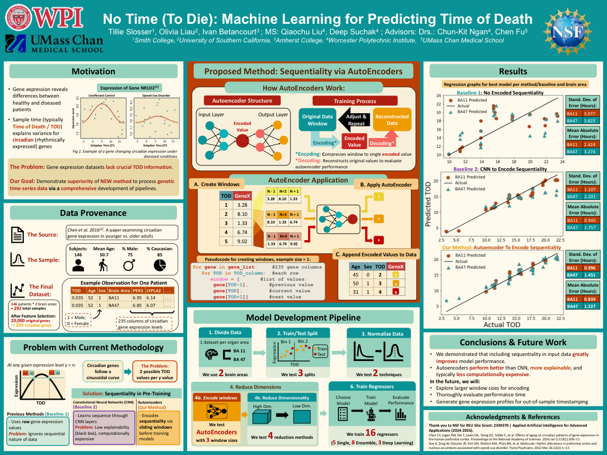
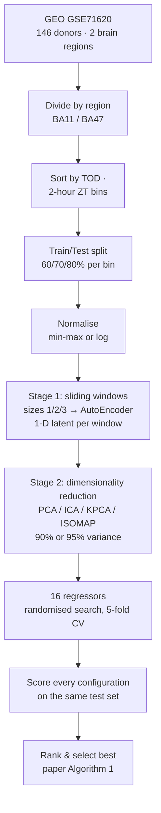

# No Time (To Die): Predicting Time of Death from Gene Expression

[](https://github.com/oleeveeuh/gr-WPI-UMASS-TOD-Prediction/actions/workflows/ci.yml)

**Published:** *Using Machine Learning Approaches for Predicting Time of Death of Human Postmortem Samples Based on Transcriptomic Data*, BIOINFORMATICS 2026 (BIOSTEC Vol. 2), pages 704–715 · [DOI 10.5220/0014636000004070](https://doi.org/10.5220/0014636000004070) · [Publisher page](https://www.scitepress.org/Papers/2026/146360/) · [PDF in this repo](results/publication/BIOINFORMATICS_2026_398_CR.pdf)

|  |  |
|---|---|
| **What** | A machine-learning study asking whether **time of death (TOD)** can be predicted from **circadian gene expression** in postmortem human brain — plus a honest 2026 re-audit of its validation. |
| **Data** | 146 human donors (GEO [GSE71620](https://www.ncbi.nlm.nih.gov/geo/query/acc.cgi?acc=GSE71620)); two prefrontal-cortex regions (BA11, BA47); 235 circadian genes per sample. |
| **Headline (paper)** | Hourly-scale MAE **0.839 h** (BA11) and **1.227 h** (BA47) — see caveats below before interpreting. |
| **Status** | Academic research prototype. **Not clinically usable, externally validated, or production-ready.** The 2026 audit in [docs/LIMITATIONS.md](docs/LIMITATIONS.md) found validation leakage in the published pipeline; a leakage-free re-analysis is included in this repo and scores far worse. |

<details>
<summary><strong>Poster</strong> (click for preview; full PDF linked)</summary>
<a href="results/publication/poster.pdf"></a>
</details>

---

## Why this project exists

Gene expression follows circadian (24-hour) rhythms, so a transcriptomic sample carries a timestamp — but most public genomic datasets never record time of death. If expression alone can recover TOD, it unlocks timestamping for the many datasets that lack it, and matters forensically and clinically (e.g., drug-timing research). Circadian genes are sinusoidal, so a single expression value is ambiguous (ascending vs descending slope): the paper's core idea was to encode short *windows* of neighbouring samples with an autoencoder before regression.

## Dataset

| | |
|---|---|
| Source | Chen et al. 2016, PNAS 113(1):206–211 — [DOI 10.1073/pnas.1508249112](https://doi.org/10.1073/pnas.1508249112) · GEO [GSE71620](https://www.ncbi.nlm.nih.gov/geo/query/acc.cgi?acc=GSE71620) |
| Subjects | 146 donors (mean age 50.7, range 16–96; 75% male; 85% Caucasian — as described in the paper); 292 samples = 2 brain regions × 146 |
| Regions | BA11 and BA47 (orbital prefrontal cortex), modeled independently |
| Features | 235 circadian genes (selected in the source study) + Age + Sex |
| Target | Time of death, in hours (`TOD` ∈ [0, 24]) |
| In this repo | `data/raw/` (phenotype, gene-selection table) and `data/processed/` (one row = one donor sample) — provenance, checksums, and ethics: [docs/DATA.md](docs/DATA.md) |

## Published pipeline (as in the paper)



The published study evaluated **16 regressors** across three input branches — non-windowed, CNN-windowed, and autoencoder-windowed — for a total of 730 + 2,304 + 2,304 pipeline-model candidates (paper §4.3):

| Category (5/8/3) | Models |
|---|---|
| Single | Linear, SVR, Decision Tree, K-Neighbors, SGD |
| Ensemble | Voting, Stacking, Gradient Boosting, Random Forest, AdaBoost, Bagging, Extra Trees, XGBoost |
| Deep learning | MLP, LSTM, CNN (PyTorch via skorch; CNN-variant scripts in TensorFlow) |

## Results **as reported in the paper**

Paper Table 2 (hourly scale; PDF p. 11 / proceedings p. 714), transcribed in
[`src/tod_pred/authoritative.py`](src/tod_pred/authoritative.py) and checkable via
`python scripts/verify_results.py --check-paper`:

| Approach | Best model (BA11) | MAE (h) | StdErr | Best model (BA47) | MAE (h) | StdErr |
|---|---|---|---|---|---|---|
| Non-temporal encoding | LSTM (PCA-90, MM-80) | 2.425* | 3.077 | LSTM (PCA-90, MM-80) | 3.274 | 3.823 |
| Temporal encoding via CNN | Bagging (PCA-90, MM-70, w3) | 0.945 | 1.107 | AdaBoost (KPCA-95, log-80, w3) | 1.757 | 2.201 |
| **Temporal encoding via AutoEncoder (paper's method)** | **Extra Trees** (ISOMAP-90, MM-80, w3) | **0.839** | 0.996 | **AdaBoost** (PCA-95, MM-70, w3) | **1.227** | 1.451 |

Full hourly-scale rows (MSE 1.013/2.153, RMSE 1.006/1.467 for the paper's method; MAPE/sMAPE) are in the paper PDF. \* Shown as 2.424 on the poster and in the pre-2026 README; the paper's table reads 2.425 (rounding of the same value). The same models' metrics on the *normalised* target scale are in paper Table 1 (p. 10) — do not mix the two scales when comparing; the best normalized-scale rows are also recoverable from the tracked experiment sheets (`python scripts/verify_results.py`).

## ⚠️ Validation caveats — read before quoting the numbers

A 2026 engineering audit of the pipeline ([docs/LIMITATIONS.md](docs/LIMITATIONS.md), with file/line evidence) confirmed:

1. **Windows span different subjects, sorted by the target.** Each row is one donor; "temporal windows" therefore contain *other donors* chosen by proximity of their TOD — the target leaks into features by construction. This is documented design in the paper (a "pseudo-multivariate time series"), but it plausibly drives most of the reported gain.
2. **Model & pipeline selection used the reported test set.** Thousands of configurations were ranked on the same test set that produced the headline numbers (no nested CV, no untouched holdout).
3. The train/test split is positional within TOD bins, so splits are not exchangeable samples.
4. Additional defects: ICA 90/95 outputs mislabelled; FastICA unseeded; option-1 features not regenerable from the repo; Excel-cell-scraped results.

Consequently the published MAEs are **optimistic lower bounds**, not expected accuracy. No external validation, clinical use, or production deployment is claimed or implied.

## Leakage-free re-analysis (new, 2026 — not from the paper)

[`src/tod_pred/`](src/tod_pred/) implements a clean protocol: no windows, no target-informed ordering, all preprocessing fitted inside training folds, model selection by **nested** cross-validation (inner randomised search), deterministic seed 42:

| Model | BA11 MAE (h), mean ± SD | BA47 MAE (h), mean ± SD |
|---|---|---|
| Mean baseline | 4.881 ± 0.318 | 4.881 ± 0.318 |
| **Ridge (best)** | **3.683 ± 0.544** | **4.044 ± 0.151** |
| RandomForest / ExtraTrees / AdaBoost / HistGB | 3.82–4.08 | 4.08–4.24 |

```bash
python scripts/run_nested_cv.py --region BA11   # ~90 s, CPU; writes results/leakage_free/
python scripts/run_nested_cv.py --region BA47
```

These results are **worse than the paper's** and are labelled as new everywhere they appear. They show that with the leakage removed, standard regressors on this dataset reach ≈3.7–4 h MAE — modestly better than predicting the mean. They do not retroactively re-evaluate the paper's models; see [docs/LIMITATIONS.md](docs/LIMITATIONS.md).

## Setup & usage

```bash
git clone https://github.com/oleeveeuh/gr-WPI-UMASS-TOD-Prediction.git
cd gr-WPI-UMASS-TOD-Prediction
python -m venv .venv && source .venv/bin/activate   # Python >= 3.10
pip install -e .[dev]

pytest -m "not slow"                                # unit tests (seconds)
python scripts/run_nested_cv.py --region BA11       # leakage-free workflow (CPU)
python scripts/verify_results.py --check-paper      # verify published-number transcription
python scripts/download_data.py                     # re-fetch/verify public source data
```

The archived, as-published pipeline lives in [`research_archive/`](research_archive/) (Python 3.10-only pins, see its README). Reproducibility details: [docs/REPRODUCIBILITY.md](docs/REPRODUCIBILITY.md).

## Repository structure

```
├── src/tod_pred/          # maintained leakage-free workflow (scikit-learn, CPU-only)
├── scripts/               # run_nested_cv / verify_results / download_data
├── configs/               # nested-CV configs per region
├── tests/                 # pytest suite (synthetic fixtures only)
├── docs/                  # LIMITATIONS · DATA · REPRODUCIBILITY (+ poster preview)
├── data/
│   ├── raw/               # public source files (GEO phenotype, PNAS S1)
│   └── processed/         # wrangled per-region datasets (1 row = 1 donor sample)
├── results/
│   ├── publication/       # paper PDF + poster PDF
│   ├── figures/           # paper-era prediction plots
│   ├── sheets/            # 21 historical per-configuration Excel result workbooks
│   ├── derived/           # tidy CSV scrapes of the sheets
│   └── leakage_free/      # NEW nested-CV outputs (labelled, not paper results)
└── research_archive/      # as-published pipeline (R + PyTorch/TF), preserved
```

## Data access & ethics

All donor data here is secondary use of the public, deidentified GEO dataset GSE71620 (originally collected under University of Pittsburgh IRB approval with next-of-kin consent — see [docs/DATA.md](docs/DATA.md)). Donors are numeric IDs only; no re-identification attempts belong anywhere near this data. One file (`data/raw/cause_of_death.csv`) has undocumented provenance and is flagged there.

## Future work

From the paper's conclusions plus this audit: probabilistic models that represent uncertainty; validation on additional circadian-expression datasets and tissues; leakage-free re-design of the sequentiality pipeline (subject-grouped CV, honest holdouts); confirming the provenance of `cause_of_death.csv`; larger-window autoencoder variants under clean validation.

## Team

**Authors (as published):** Olivia Liau (USC) · Tillie Slosser (Smith College) · Ivan Betancourt (Amherst College) · Qiaochu Liu (WPI) · Chun-Kit Ngan (WPI) · Chen Fu (UMass Chan) · Ryan W. Logan (UMass Chan) · Nitya Phani Santosh Oruganty (WPI)

**Mentors & advisors:** Dr. Chun-Kit Ngan, Dr. Chen Fu (advisors), Qiaochu Liu, Deep Suchak, Ryan W. Logan, Nitya Phani Santosh Oruganty

**Funding:** NSF REU Site Grant 2349370 — *Applied Artificial Intelligence for Advanced Applications (2024–2026)*. Any opinions, findings, and conclusions are the authors' and do not reflect NSF's views.

<details>
<summary><strong>My contributions</strong> (Olivia Liau — individual work, distinct from the team's)</summary>

Team accomplishments are listed above and authorship reflects the whole group. Within the project, my individual contributions were:

- **Python modeling pipeline** — shared training/evaluation infrastructure (`read_train.py`, `model_definitions.py`), the option_1/2/3 model runners, and the dimensionality-reduction scripts (`DR_code/`), including the PyTorch AutoEncoder/CNN/LSTM model definitions.
- **Results & visuals** — aggregating model results into the performance workbooks, scraping/ranking them (`find_best_models.py`), and producing the result figures and visual reports.
- **Paper & documentation** — writing and revising the BIOINFORMATICS 2026 paper, and repository curation/documentation (this cleanup included).

The R data-wrangling steps (`data_combining.R`, `train_test_splitting.R`) were led by collaborators; the 2026 leakage audit and the new `src/tod_pred/` workflow are post-publication engineering work by me.
</details>

## License

Three separate layers: **code** — MIT ([LICENSE](LICENSE)); **paper** — CC BY-NC-ND 4.0 via SciTePress; **data** — per GEO/PNAS terms, cite Chen et al. 2016. See [docs/DATA.md](docs/DATA.md).

## Citation

```bibtex
@InProceedings{liau2026tod,
  author    = {Olivia Liau and Tillie Slosser and Ivan Betancourt and Qiaochu Liu and
               Chun-Kit Ngan and Chen Fu and Ryan W. Logan and Nitya Phani Santosh Oruganty},
  title     = {Using Machine Learning Approaches for Predicting Time of Death of Human
               Postmortem Samples Based on Transcriptomic Data},
  booktitle = {Proceedings of the 19th International Joint Conference on Biomedical
               Engineering Systems and Technologies (BIOSTEC) -- Volume 2: BIOINFORMATICS},
  pages     = {704--715},
  year      = {2026},
  publisher = {SciTePress},
  doi       = {10.5220/0014636000004070}
}
```

**Key references:** Chen, C.-Y., et al. (2016). Effects of aging on circadian patterns of gene expression in the human prefrontal cortex. *PNAS* 113(1):206–211, [doi:10.1073/pnas.1508249112](https://doi.org/10.1073/pnas.1508249112) (dataset) · Xue, X., et al. (2022). Molecular rhythm alterations in prefrontal cortex and nucleus accumbens associated with opioid use disorder. *Translational Psychiatry* 12:389, [doi:10.1038/s41398-022-01845-y](https://doi.org/10.1038/s41398-022-01845-y) · full reference list in the [paper PDF](results/publication/BIOINFORMATICS_2026_398_CR.pdf).
